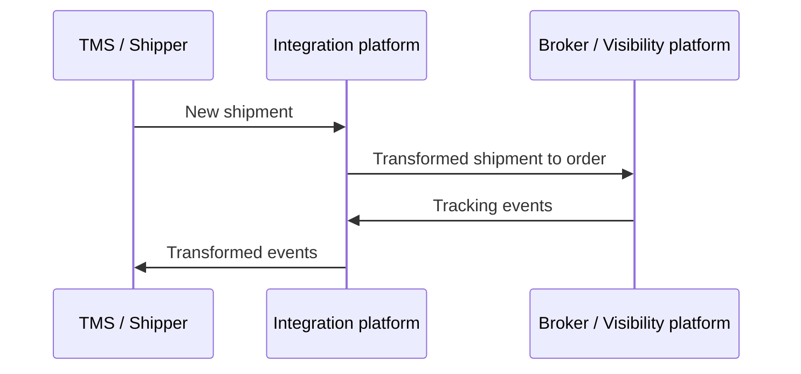

# Integration sandbox

## Intro
Integration platforms need real systems to test against. Setting up these systems is expensive and slow. This sandbox provides the mock endpoints to test against, so you can test integration flows immediately.
You should be able to test the following features in integration platforms: 
  - receive messages via an API/web-hook
  - interact with an API
  - transform messages / perform a data mapping
  - conditional routing
  - batch processing
  - scheduling
  - error handling
  - authentication
  
## Use case
The sandbox's theme is _Transport and Logistics_. Specifically the integration between a __Shipper__ and a __Broker__. 

Imagine you are a Shipper with a TMS that needs to send orders to a Carrier. The Carrier requires all communication to go through their preferred Broker (visibility platform).
Your integration platform sits in the middle, transforming TMS data to the Broker format and handling events back.




## Features
If you run this API you will have access to the following endpoints:
### Broker
| Method | Endpoint                     | Description                       |
| ------ | ---------------------------- | --------------------------------- |
| POST   | `/api/v1/broker/order/`      | Receive and validate broker order |
| POST   | `/api/v1/broker/events/`     | Create new broker event           |
| GET    | `/api/v1/broker/events/`     | Get events                        |
| POST   | `/api/v1/broker/events/seed` | Seed events                       |

### TMS
| Method | Endpoint                          | Description                    |
| ------ | --------------------------------- | ------------------------------ |
| POST   | `/api/v1/tms/event/{shipment_id}` | Receive and validate TMS event |
| POST   | `/api/v1/tms/shipments/`          | Create new TMS shipment        |
| GET    | `/api/v1/tms/shipments/`          | Get shipments                  |
| POST   | `/api/v1/tms/shipments/seed`      | Seed shipments                 |
| GET    | `/api/v1/tms/shipments/new`       | Get new shipments              |

### Trigger
| Method | Endpoint                     | Description                     |
| ------ | ---------------------------- | ------------------------------- |
| POST   | `/api/v1/trigger/shipments/` | Generate multiple new shipments |
| POST   | `/api/v1/trigger/events/`    | Generate tracking events        |

### System
| Method | Endpoint     | Description            |
| ------ | ------------ | ---------------------- |
| POST   | `/token`     | Login for access token |
| GET    | `/users/me/` | Read current user      |
| GET    | `/health`    | Health check           |


## How does it come together?
On a high level, dummy TMS shipments and Broker events are generated and saved in a database (for as long as your container lives).
When you send a transformed message to the API it will pull the generated mock data from the database and validate the message based on the business logic for that mapping.
You can find the specs of the mappings here:

- [TMS Shipment to Broker Order](./docs/integrations/tms-to-visibility.md)
- [Broker Event to TMS Event](./docs/integrations/visibility-to-tms.md) 

### Authenticating
- **Login**: POST to `/token` with credentials (see the chapter on configuration)
- **Token**: Include in `Authorization: Bearer <token>` header

### Creating shipments
Looking at the diagram of the use case you will first need new shipments. 

You have two options to create shipments depending on the type of integration you want to make:
- For __push based__ integrations you can use the `/api/v1/trigger/shipments` endpoint. This endpoint takes in a target URL (your integration platform webhook) and a count and will send 1 payload with the requested number of shipments. 
  - It will also send a `X-API-KEY` header that you can use to secure the endpoint with. See the config section on how to change the default key.
- For __pull based__ integrations you first must seed shipments using `/api/v1/tms/shipments/seed`, then your integration platform can fetch them from `/api/v1/tms/shipments/new`.
  - _Note: It's also possible to request a limit of results so that you can test scheduled based retrieval._  
- The default maximum of shipments per call to seed/trigger is 1000. 

### Validating the TMS shipment to Broker order transformation
It's as simple as sending the transformed message to the  `/api/v1/broker/order/` endpoint. 
- If the validation is successful the API will respond with a `HTTP 202 ACCEPTED`.
- If there is something wrong with the transformation the API will respond with a `HTTP 422 UNPROCESSABLE ENTITY`. 
  - In that case the details section of the response should indicate which fields are invalid.
- `HTTP 500 INTERNAL SERVER ERROR` can occur if something is wrong with the database file or a constraint in the database. Or I have introduced a bug ;)
  
### Creating events for shipments
The same applies here as for creating shipments. But keep in mind that events are linked to shipments. So you will first need those:
- For __push based__ integrations you can use the `/api/v1/trigger/events` endpoint. This endpoint takes in a target URL (your integration platform webhook) a `event_type` (enum value) and a list of shipment Id's and will then send a payload of that event per shipment.
  
- For __pull based__ integrations you first must seed events using `/api/v1/broker/events/seed`, then your integration platform can fetch them from `/api/v1/broker/events/new`.

Once an event is validated, the event is added to the TMS shipment payload in the `timeline_events` object and the external order number `external_reference` is referenced.
Note: Duplicate events are overwritten!!

### Validating the broker event to shipment event transformation
Same principles apply here as in [Shipment validation](#validating-the-tms-shipment-to-broker-order-transformation)
  
### Example test playbook

| Step | System | Action | Event Type | Endpoint |
|------|--------|--------|------------|----------|
| 1 | HTTP Client | Seed shipments | - | `POST /api/v1/tms/shipments/seed` |
| 2 | Integration Platform | Pull shipments | - | `GET /api/v1/tms/shipments/new` |
| 3 | Integration Platform | Transform & send order | - | `POST /api/v1/broker/order/` |
| 4 | HTTP Client | Trigger ORDER_CREATED | ORDER_CREATED | `POST /api/v1/trigger/events/` |
| 5 | Integration Platform | Transform & send event | ORDER_CREATED | `POST /api/v1/tms/event/{shipment_id}` |
| 6 | HTTP Client | Trigger DRIVING_TO_LOAD | DRIVING_TO_LOAD | `POST /api/v1/trigger/events/` |
| 7 | Integration Platform | Transform & send event | DRIVING_TO_LOAD | `POST /api/v1/tms/event/{shipment_id}` |
| 8 | HTTP Client | Trigger ORDER_LOADED | ORDER_LOADED | `POST /api/v1/trigger/events/` |
| 9 | Integration Platform | Transform & send event | ORDER_LOADED | `POST /api/v1/tms/event/{shipment_id}` |
| 10 | HTTP Client | Trigger ORDER_DELIVERED | ORDER_DELIVERED | `POST /api/v1/trigger/events/` |
| 11 | Integration Platform | Transform & send event | ORDER_DELIVERED | `POST /api/v1/tms/event/{shipment_id}` |

## Limitations
Since we're handling dummy data that is generated there are obviously some shortcomings if one would look at the data with a close eye:
- The data is supposed to __look like__ simplified Transport and Logistics data.
  - For example there are no calculations on the loading meters and validations for what fits in a truck.
  - Location coordinates might be in the sea and regulatory requirements (hazmat labels, loading capacity) are ignored.
  - Package types and goods descriptions don't match so you might get "medical oxygen tanks" labeled as BOX type instead of CYLINDER, or "bulk quinoa grain" shipped on a flatbed truck
- The sequence of events is also not enforced. You will have to do this yourself. It's possible to unload before loading etc.
- Times are randomly generated in the future. Which can look funny. The goal is that the transformation works.


## Quick Start
### Local Python env managed by [uv](https://docs.astral.sh/uv/).

1. **Install dependencies**
   ```bash
   uv install
   ```

1. **Run the application**
   ```bash
   uv run fastapi dev integrationsandbox/main.py
   ```
### Using the [Docker](https://docs.docker.com/get-docker/) container
1. **Build image**
    ```bash
    docker build -t atetz/integration-sandbox .
    ```
1. **Run container**
    ```bash
    docker run -d -p 8000:8000 --name integration-sandbox atetz/integration-sandbox   
    ```
If you want to use an env file, simply add: --env-file .env 

1. **Access API documentation**
   - Swagger UI: http://localhost:8000/docs
   - ReDoc: http://localhost:8000/redoc

1. **Test the health endpoint**
   ```bash
   curl http://localhost:8000/health
   ```

## Configuration

All configuration is handled through environment variables that can be set via `.env` file or system environment.

### Authentication
| Variable | Default | Description |
|----------|---------|-------------|
| `DEFAULT_USER` | `sandy` | Default username for token authentication |
| `DEFAULT_PASSWORD` | `sandbox` | Default password for token authentication |
| `WEBHOOK_API_KEY` | auto-generated | API key for webhook authentication |
| `JWT_SECRET_KEY` | auto-generated | JWT signing key (randomly generated if not set) |
| `JWT_ALGORITHM` | `HS256` | JWT signing algorithm |
| `JWT_EXPIRE_MINUTES` | `15` | JWT token expiration time in minutes |

### Database
| Variable | Default | Description |
|----------|---------|-------------|
| `DATABASE_PATH` | `integrationsandbox/infrastructure/db.sqlite3` | SQLite database file location |

### API Limits
| Variable | Default | Description |
|----------|---------|-------------|
| `MAX_BULK_SIZE` | `1000` | Maximum number of items per bulk operation (seed/trigger) |
| `FLOAT_PRECISION` | `2` | Decimal precision for float values |

### Logging
| Variable | Default | Description |
|----------|---------|-------------|
| `LOG_LEVEL` | `INFO` | Logging level (DEBUG, INFO, WARNING, ERROR) |
| `LOG_FILE_PATH` | `fastapi.log` | Log file location |
| `LOG_FILE_MAXBYTES` | `10485760` | Maximum log file size (10MB) |

### CORS Settings
| Variable | Default | Description |
|----------|---------|-------------|
| `CORS_ORIGINS` | `["*"]` | Allowed CORS origins (comma-separated for .env) |
| `CORS_CREDENTIALS` | `true` | Allow credentials in CORS requests |
| `CORS_METHODS` | `["*"]` | Allowed HTTP methods (comma-separated for .env) |
| `CORS_HEADERS` | `["*"]` | Allowed CORS headers (comma-separated for .env) |

### Using .env File
Create a `.env` file in the project root:
```env
DEFAULT_USER=myuser
DEFAULT_PASSWORD=mypassword
JWT_SECRET_KEY=your-secret-key-here
MAX_BULK_SIZE=500
LOG_LEVEL=DEBUG
```